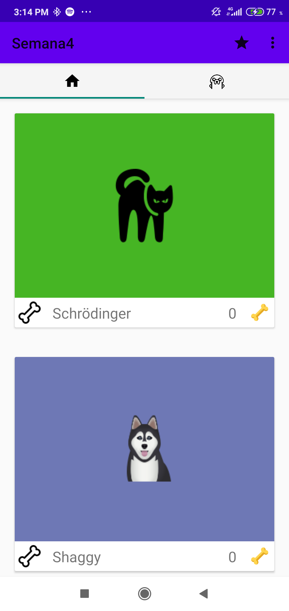
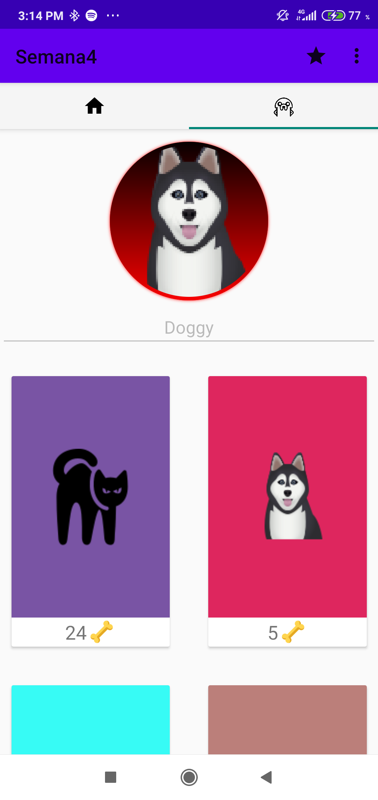
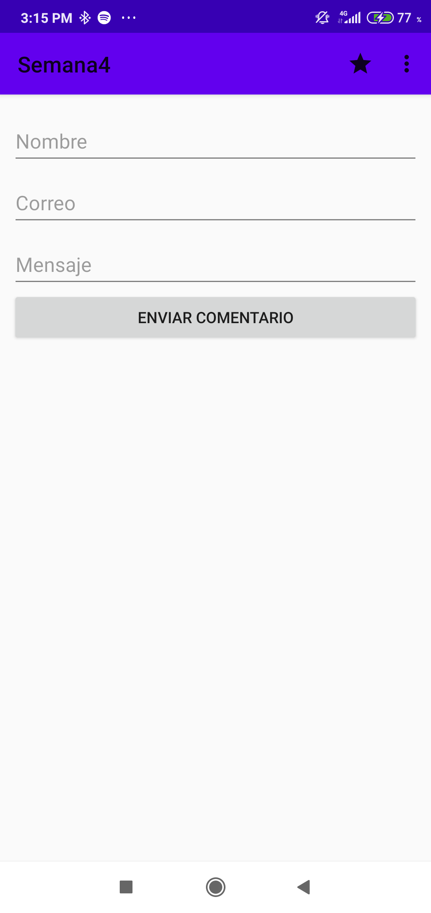
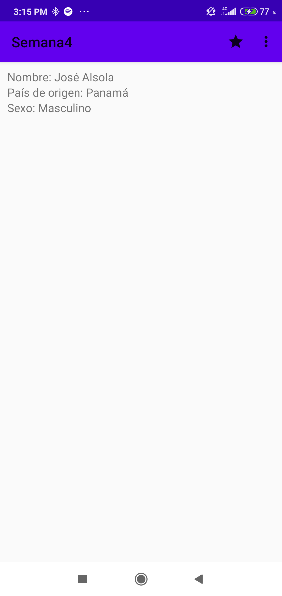

# Semana4_Menus_Fragments

Implementando el ViewPager2 al principio fue un problema debido a que en el video del curso utlizan el ViewPager y 
no el último que veo por documentación mantiene mas cositas que ayudan al desarrollador para la hora implentar animación mas amigables.

En la opción de contacto deben ingresar su corre oy contraseña en el proyecto para que les funcione la libreria JaveMail, si ven otra forma más fácil de implementar me avisan.

En la pantalla de Sobre mi no puse nada en especial, solamente datos por un TextView.

